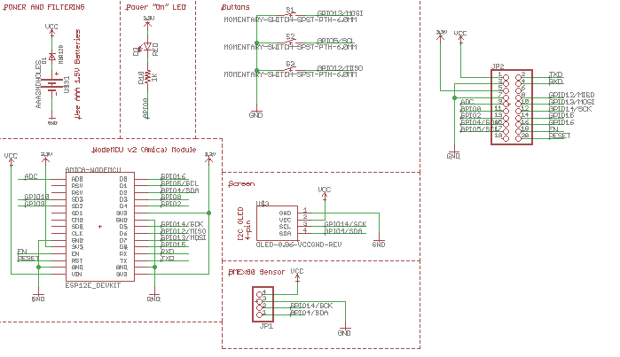
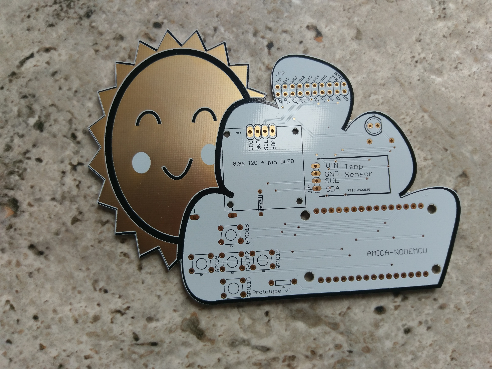
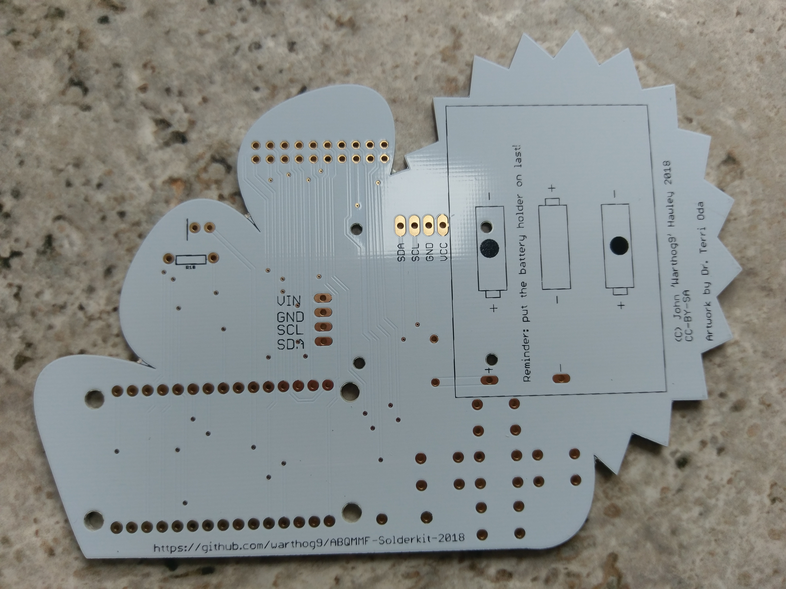

# 2018 Albuquerque Mini-Maker Faire Soldering Kit

This is the 2018 Albuquerque Mini-Maker Faire soldering kit, it's intended
to be a useful item that people will actually use as opposed to just a
series of blinky LEDs.  It makes use of the NodeMCU, which is based on the
ESP8266, a microcontroller that has wifi capabilities.

## Out of the box
Out of the box the kit will include the following things:
* PCB of the Cloud Sun variety (pictured below)
* 2x 15-pin, female, 0.1" headers
* 2x 4-pin, female, 0.1" headers
* 1x 1K Ohm resistor
* 1x 5mm Red LED
* 1x Diode
* 1x 3-AAA battery pack
* 1x Red button (intended to go in the middle - but doesn't matter)
* 4x Black buttons (electrically identical to the red)
* 1x 2x10-pin, male, 0.1" header
* 1x I2C, 4-pin, OLED screen
* 1x BME280, I2C 4-pin, breakout board
* 1x NodeMCU v2 (CP2102 USB chip type)

The board will boot up, once soldered up, and will show the following information on the OLED screen:
* Battery level (upper right corner)
* Temperature
* Barometric pressure
* Relative humidity

The buttons do the following:
* Top: Increases OLED screen brightness
* Bottom: Decreases OLED screen brightness
* Middle: Toggles temperature readout between Celsius and Fahrenheit (Default Fahrenheit)
* Left: Toggles between condensed or extended text on the OLED screen
* Right: Will toggle the two extra LEDs on the ESP12e/f module and the NodeMCU itself

The NodeMCU has been pre-loaded with [MicroPython](https://micropython.org), which is a slimmed down version of Python 3 intended for micro-controllers.  This is greater for people to start with, and you can find some basic tutorials on how to interact with the board quickly here:

* https://docs.micropython.org/en/latest/esp8266/esp8266/tutorial/intro.html
* https://github.com/unreproducible/tinysnakes

Wifi is disabled for this demo via [boot.py](https://github.com/warthog9/ABQMMF-Solderkit-2018/blob/master/src/boot.py), but can be easily changed and/or re-enabled.

Files were uploaded to the board using [ampy](https://github.com/adafruit/ampy)

## Schematic

Full schematic is here: [Schematic PDF](abqmmf2018-schematic.pdf)

### PCB outline

### Prototype built up

### Raw PCBs (prototypes)

